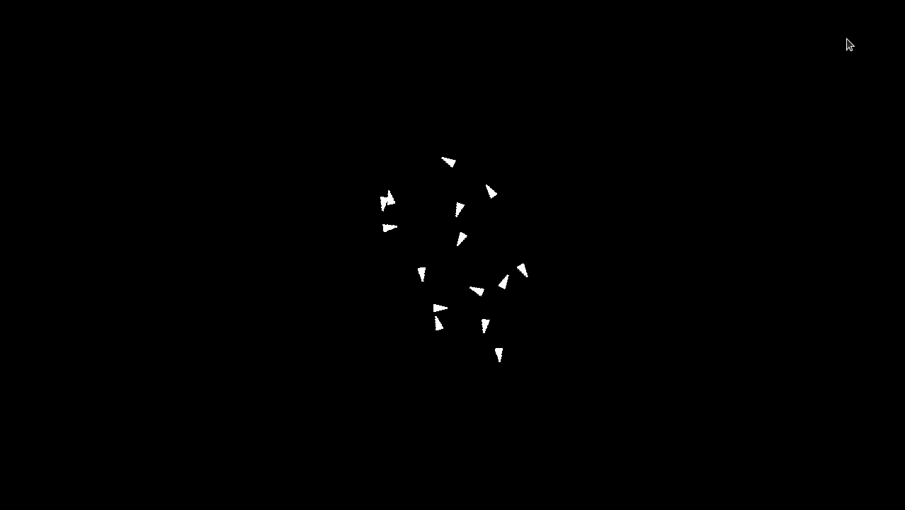

# This is my implementation of Boid algorithm. 

Boid algorithm is that simulate flocking behavior in birds. It is also well known that the rule for the behavior is reasonably simple. 

Source 

Explanation is here: https://cs.stanford.edu/people/eroberts/courses/soco/projects/2008-09/modeling-natural-systems/boids.html

Pseudocode I use for reference: https://vergenet.net/~conrad/boids/pseudocode.html

